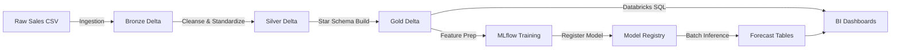
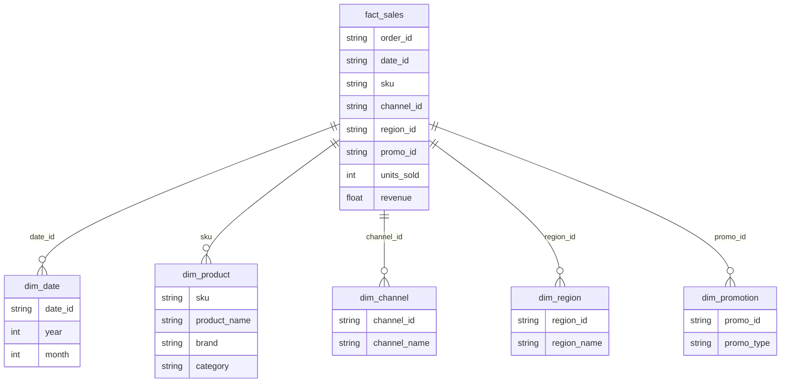
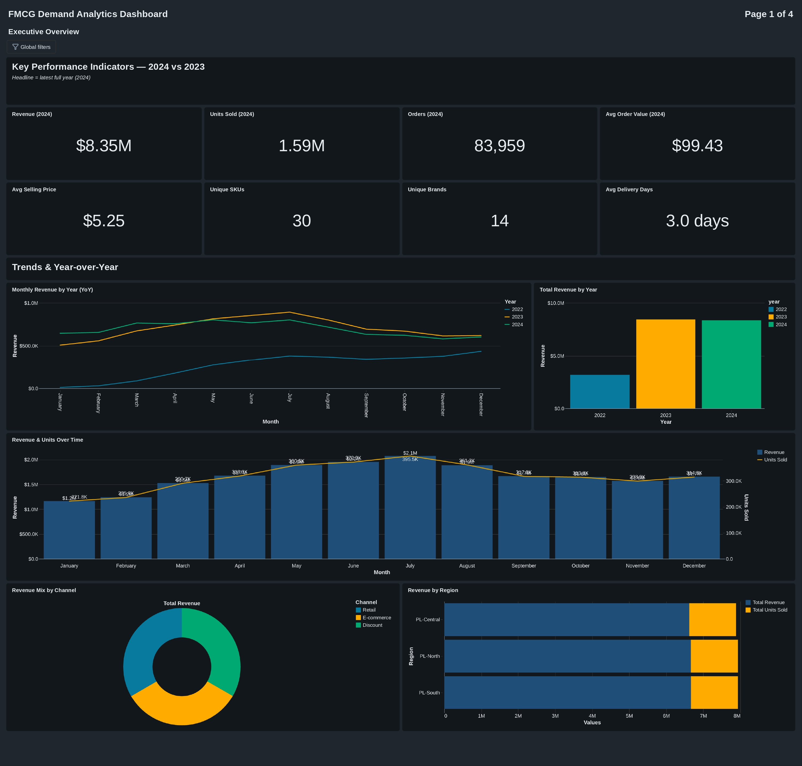
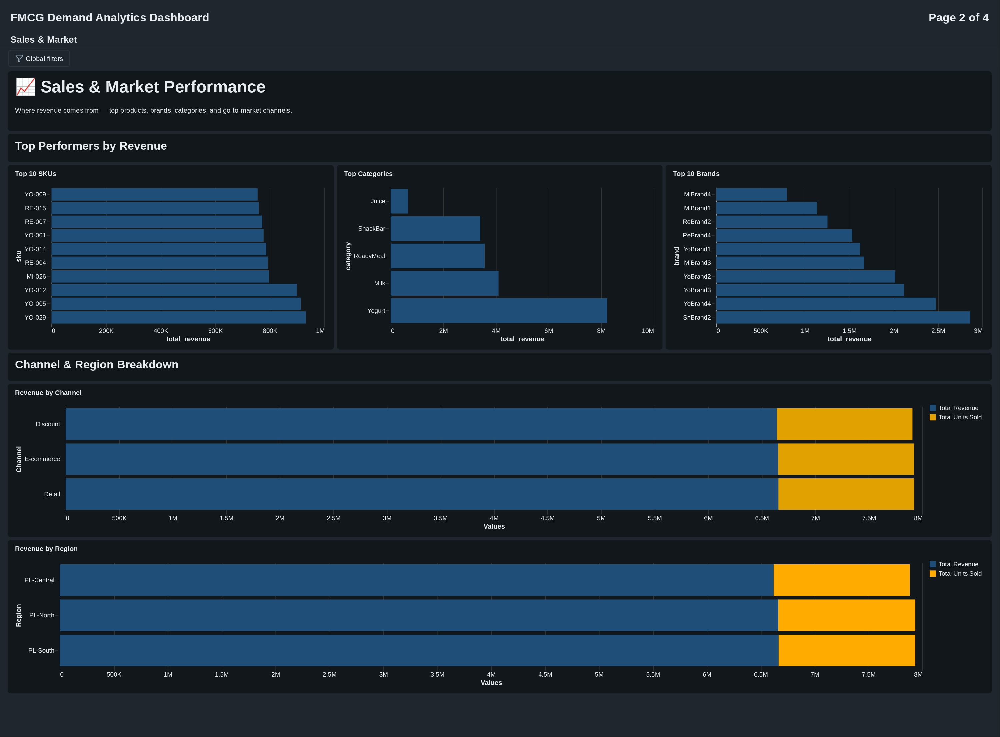
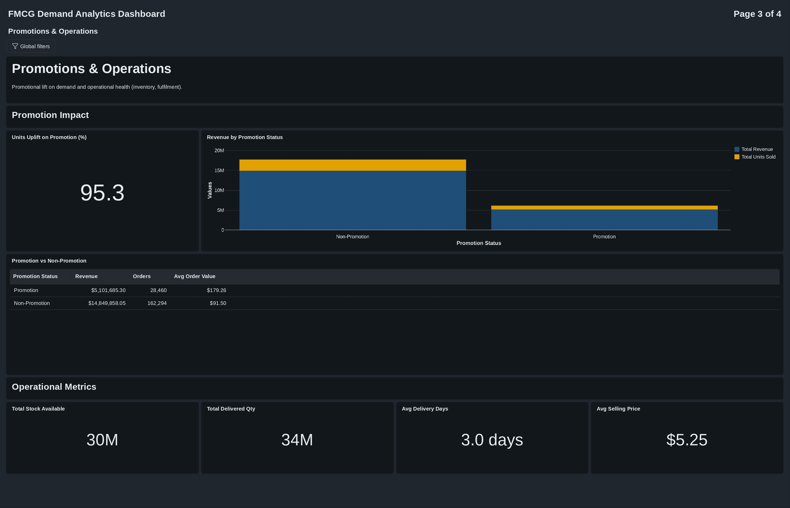
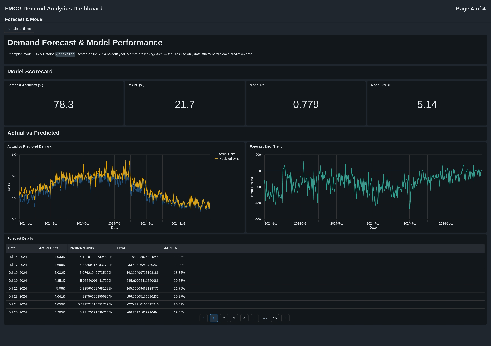
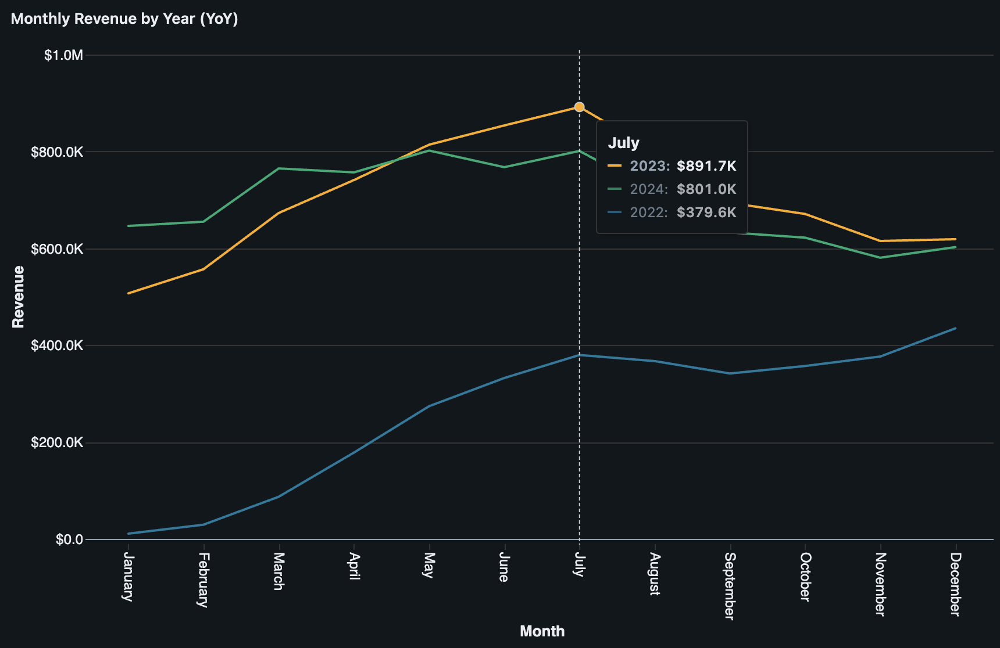
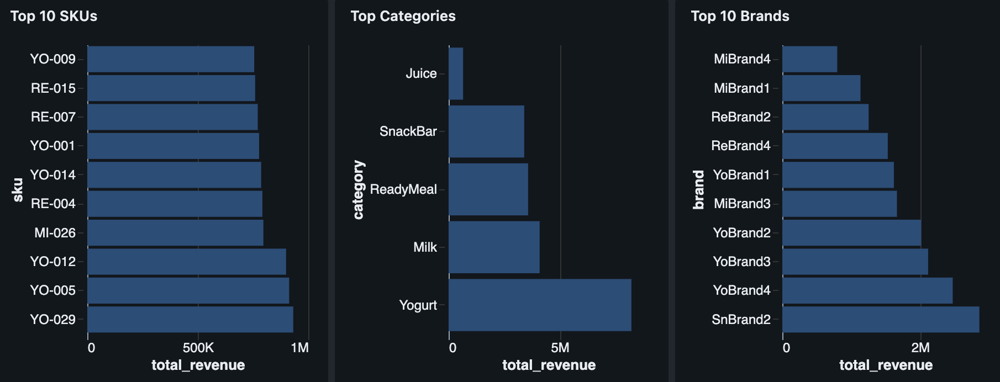
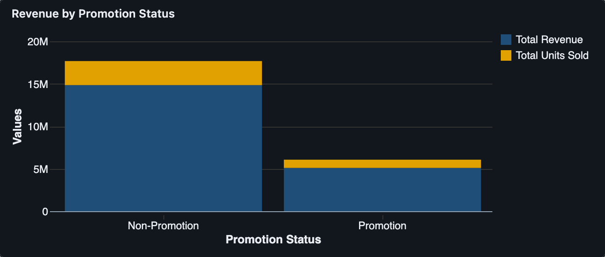

  <!-- Ganti src di bawah dengan URL logo atau header Anda -->

<h1 align="center">FMCG Sales Demand Forecasting & Performance Analytics</h1>
<table align="center">
  <tr>
    <td width="1440">
      <h2 align="center">Client Background & Problem Statement</h2>
      <body>
        <strong>FMCG (Fast-Moving Consumer Goods)</strong> companies operate in a highly dynamic, high-volume environment. Understanding what drives sales, be it pricing, promotion, seasonality, or distribution channel, is critical for survival and growth.  
         
        This project focuses on a comprehensive <strong>Data & AI pipeline</strong> built on the Databricks Lakehouse platform. It leverages 2 years of sales transaction data (2022–2024) containing information across multiple dimensions: products, brands, categories, channels, and regions.  
         Reporting to the Supply Chain and Commercial teams, an in-depth analysis and predictive modeling workflow was developed to evaluate historical performance and forecast future demand. The key insights and machine learning outputs focus on the following areas:
      </body>
      <h3>Northstar Metrics</h3>
      <h4>
        <ul>
          <li><strong>Total Revenue & Units Sold</strong> - Core indicators of top-line business growth and market penetration.</li>
          <li><strong>Sell-through Rate</strong> - Evaluating (units sold / stock available) to indicate inventory efficiency.</li>
          <li><strong>Delivery Gap</strong> - Analyzing the difference between delivered quantity and units sold to highlight supply chain bottlenecks.</li>
          <li><strong>Forecast Accuracy</strong> - Using RMSE, MAE, and R² to measure the reliability of Machine Learning demand predictions.</li>
        </ul>
      </h4>
    </td>
  </tr>
</table>

<h1 align="center">Executive Summary</h1>
<h3 align="center">Data Pipeline & Orchestration Architecture</h3>

<table align="center">
  <tr>
    

      <td width="460" valign="top">
        <ol>
          <li>
            <strong>Medallion Data Architecture:</strong>
            <ul>
              <li><strong>Bronze Layer:</strong> Raw transactional CSV data is ingested and stored as Delta tables to preserve history and provide an auditable source of truth.</li>
              <li><strong>Silver Layer:</strong> Data is cleansed, standardized (handling negative operational metrics), and augmented with data quality flags and temporal attributes.</li>
              <li><strong>Gold Layer:</strong> Data is structured into a robust Star Schema consisting of dimensional tables (Date, Product, Channel, Region, Promotion) and a core Fact table to support high-performance analytics.</li>
            </ul>
          </li>
          <li>
            <strong>Machine Learning & Demand Forecasting:</strong>
            <ul>
              <li>Engineered features (price, stock, promotion flags) were used to train a predictive model for <code>units_sold</code> at the SKU level.</li>
              <li>Utilized <strong>Databricks MLflow</strong> to track experiments comparing Linear Regression, Random Forest, and GBT Regressors.</li>
            </ul>
          </li>
        </ol>
      </td>
      <td width="460" valign="top">
        <ol start="3">
          <li>
            <strong>Databricks SQL Dashboards:</strong>
            <ul>
              <li>The pipeline surfaces data into interactive executive and operational dashboards.</li>
              <li>Stakeholders can monitor top-performing brands, channel-region synergies, and analyze the financial impact of promotional campaigns.</li>
            </ul>
          </li>
          <li>
            <strong>Automated Orchestration:</strong>
            <ul>
              <li>The entire workflow, from data ingestion and ETL to model training and batch inference, is orchestrated sequentially using <strong>Databricks Workflows (Jobs)</strong>.</li>
              <li>This ensures business stakeholders always have access to fresh data and the latest demand forecasts without manual intervention.</li>
            </ul>
          </li>
        </ol>
      </td>
    

  </tr>
</table>

<h2 align="center">Dataset Structure and ERD (Entity Relationship Diagram)</h2>
<body>The Gold Layer data model follows a Star Schema design to optimize read performance for analytical queries. The central <code>fact_sales</code> table is linked to five dimension tables.</body>

<h1 align="center">Insights Deep-Dive</h1>
<h1 align="center">Dashboard Visualizations & ML Performance</h1>
<table align="center">
  <tr>
    <td width="500" align="center">
      <h3>1. Executive Overview</h3>
      
    </td>
    <td width="500" align="center">
      <h3>2. Sales & Market</h3>
      
    </td>
  </tr>
  <tr>
    <td width="500" align="center">
      <h3>3. Promotions & Operations</h3>
      
    </td>
    <td width="500" align="center">
      <h3>4. Forecast & Model</h3>
      
    </td>
  </tr>
</table>

<table>
  <tr>
    <td>
      <strong>1. Sales & Revenue Analysis (Year-over-Year Trends)</strong>
      

           
      

      <ol>
        <li>Consistent Mid-Year Peak Performance
          <ul>
            <li>Unlike typical retail that peaks in Q4, the FMCG dataset indicates strong, sustained sales peaking around <strong>July</strong>. The year 2024 generated <strong>$8.35M</strong> in revenue with <strong>1.59M</strong> units sold, demonstrating robust year-over-year growth.</li>
            <li>The Average Order Value (AOV) stands healthy at <strong>$99.43</strong>, indicating solid basket sizes for consumer goods.</li>
          </ul>
        </li>
      </ol>
       
      <strong>2. Product & Category Dominance</strong>
      

           
      

      <ol>
        <li>Yogurt and Milk Drive the Core Volume
          <ul>
            <li>The Top Categories chart reveals that <strong>Yogurt</strong> and <strong>Milk</strong> are the absolute powerhouse categories, driving the vast majority of total revenue (approaching 8M).</li>
            <li>Top-performing SKUs like <strong>YO-009</strong> and <strong>RE-015</strong>, along with top brands like <strong>SnBrand2</strong> and <strong>YoBrand4</strong>, should be the primary focus for inventory prioritization to prevent stockouts.</li>
          </ul>
        </li>
      </ol>
       
      <strong>3. Promotional Impact & Operations</strong>
      

           
      

      <ol>
        <li>Massive Uplift from Promotions
          <ul>
            <li>Promotions are highly effective in this ecosystem. The data shows a staggering <strong>95.3% Units Uplift</strong> during promotional periods.</li>
            <li>Interestingly, the Average Order Value (AOV) during promotions is <strong>$179.26</strong>, which is nearly double the non-promoted AOV ($91.50). This suggests that customers are heavily stocking up (buying in bulk) when discounts are active.</li>
          </ul>
        </li>
        <li>Supply Chain Stability
          <ul>
            <li>With an average delivery time of <strong>3.0 days</strong> and a total stock available of 30M units, the operational logistics remain stable despite high-volume promotional surges.</li>
          </ul>
        </li>
      </ol>
    </td>
  </tr>
</table>

<h2 align="center">Future Improvements</h2>
<ul>
  <li><strong>Customer Segmentation:</strong> Integrate CRM data to conduct cohort and retention analysis, enhancing personalization strategies.</li>
  <li><strong>Profitability Analytics:</strong> Incorporate Cost of Goods Sold (COGS) to shift KPIs from top-line revenue to gross margin and profitability.</li>
  <li><strong>Automated Retraining:</strong> Enhance Databricks Workflows to detect data drift and automatically trigger model retraining pipelines.</li>
</ul>
