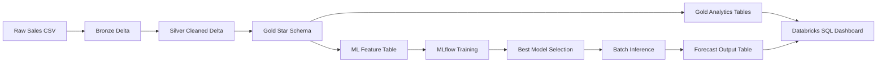
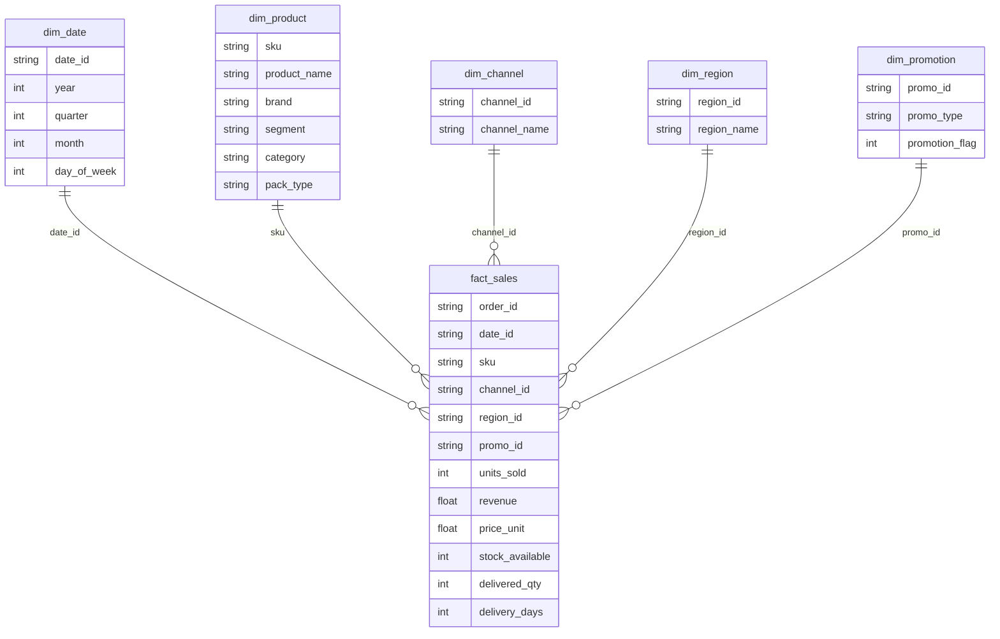
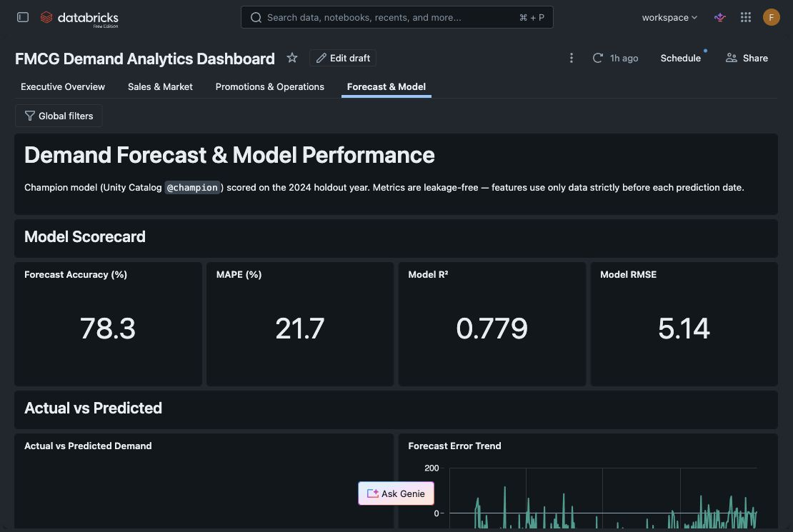

<div align="center">
  <h1>FMCG Sales Demand Forecasting & Performance Analytics</h1>
  <p>
    End-to-end Databricks Lakehouse project for FMCG sales performance analysis,
    executive dashboards, and SKU-level demand forecasting.
  </p>
</div>

<p align="center">
  
</p>

## Client Background

FMCG companies operate in a fast-moving, high-volume environment where demand can shift quickly across product categories, sales channels, regions, and promotion periods. Small changes in pricing, stock availability, delivery performance, or campaign timing can materially affect revenue and fulfillment planning.

This project analyzes FMCG sales activity from **2022 to 2024** and builds a production-style analytics workflow on the **Databricks Lakehouse**. The pipeline transforms raw transaction data into curated Delta tables, business-ready dashboard views, and a machine learning output table for demand forecasting.

The final output is designed for Supply Chain and Commercial stakeholders who need to monitor performance, understand demand drivers, and use forecast signals to support inventory and promotion decisions.

## Northstar Metrics

| Metric | Why It Matters |
| --- | --- |
| **Revenue** | Measures commercial performance and category contribution. |
| **Units Sold** | Captures demand volume across SKUs, channels, and regions. |
| **Average Order Value** | Shows basket size and promotion-driven buying behavior. |
| **Sell-through Rate** | Compares sold units against available stock to evaluate inventory efficiency. |
| **Delivery Gap** | Highlights potential fulfillment or supply chain mismatches. |
| **Forecast Accuracy** | Measures how reliably the model predicts SKU-level demand. |

## Business Snapshot

| KPI | 2024 Result |
| --- | ---: |
| Revenue | **$8.35M** |
| Units Sold | **1.59M** |
| Orders | **83,959** |
| Average Order Value | **$99.43** |
| Average Selling Price | **$5.25** |
| Unique SKUs | **30** |
| Unique Brands | **14** |
| Average Delivery Time | **3.0 days** |

## Executive Summary

The 2024 dashboard shows a mature FMCG business with strong mid-year sales momentum, healthy order value, and stable fulfillment performance. Revenue reached **$8.35M** with **1.59M** units sold, while average delivery time remained steady at **3.0 days**.

Three themes stand out:

1. **Revenue is seasonal and peaks around mid-year.** Sales momentum strengthens through the first half of the year, with July emerging as the strongest period.
2. **Category concentration is clear.** Yogurt and Milk are the main revenue drivers, supported by high-performing SKUs such as **YO-009**, **RE-015**, and **RE-007**.
3. **Promotions materially change demand behavior.** Promotional periods generate a **95.3% uplift in units**, indicating strong campaign sensitivity and bulk-buying behavior.
4. **Forecasting output is strong enough for planning use cases.** The champion model reached **78.3% forecast accuracy**, **21.7% MAPE**, **0.779 R2**, and **5.14 RMSE** on the 2024 holdout year.

## Project Outputs

| Output | Description |
| --- | --- |
| **Medallion Data Pipeline** | Raw CSV data is ingested into Bronze, standardized in Silver, and modeled into Gold Delta tables. |
| **Gold Star Schema** | A fact table and five dimension tables support analytical querying and dashboard performance. |
| **Databricks SQL Dashboard** | Four executive dashboard pages cover revenue trends, product performance, promotions, operations, and forecasting. |
| **MLflow Forecasting Workflow** | Linear Regression, Random Forest, and GBT models are trained and evaluated for `units_sold` prediction. |
| **Batch Inference Table** | Forecast outputs are written to `gold_demand_forecast_predictions` for dashboard consumption. |
| **Workflow Orchestration Design** | Databricks Jobs define the recommended notebook execution sequence from ingestion to inference. |

## Data Pipeline Architecture



### Medallion Layers

| Layer | Table Examples | Purpose |
| --- | --- | --- |
| **Bronze** | `bronze_fmcg_sales_raw` | Preserves raw CSV records with ingestion metadata. |
| **Silver** | `silver_fmcg_sales_cleaned` | Standardizes data types, creates revenue, handles negative operational values, and adds quality flags. |
| **Gold** | `fact_sales`, `dim_product`, `gold_product_performance` | Serves analytics-ready dimensional tables, KPI tables, and model feature tables. |
| **Forecast Output** | `gold_demand_forecast_predictions` | Stores scored records, prediction errors, model metrics, and predicted revenue. |

## Dataset Structure and ERD

The Gold layer uses a star schema to make the dashboard and forecasting workflow easier to query and maintain. The central `fact_sales` table links each sales record to date, product, channel, region, and promotion dimensions.



## Dashboard Preview

| Executive Overview | Sales & Market |
| :---: | :---: |
|  |  |

| Promotions & Operations | Forecast & Model |
| :---: | :---: |
|  |  |

## Insights Deep-Dive

### 1. Revenue Trend and Seasonality

<p align="center">
  
</p>

The revenue pattern is not a typical year-end retail spike. Instead, the strongest demand appears around the middle of the year, with July standing out as the peak sales period.

Key findings:

- 2024 revenue reached **$8.35M** with **1.59M** units sold.
- Average Order Value held at **$99.43**, showing healthy basket size.
- Monthly revenue and units sold move closely together, which suggests that growth is primarily volume-led rather than price-led.
- Mid-year demand should be treated as a key planning window for inventory, replenishment, and campaign timing.

### 2. Product and Category Performance

<p align="center">
  
</p>

Revenue is concentrated in a small set of categories and SKUs. This makes assortment planning and stock prioritization especially important.

Key findings:

- **Yogurt** and **Milk** are the strongest revenue-driving categories.
- Top SKUs include **YO-009**, **RE-015**, **RE-007**, **YO-001**, and **YO-014**.
- Leading brands such as **SnBrand2**, **YoBrand4**, and **YoBrand3** should be protected from stockout risk during high-demand periods.
- Lower-performing categories should be reviewed for assortment rationalization, pricing changes, or targeted promotions.

### 3. Promotion Impact and Operations

<p align="center">
  
</p>

Promotions have a clear effect on demand behavior. Customers appear to buy more units when discounts or campaign mechanics are active.

Key findings:

- Promotional records produced a **95.3% uplift in units sold**.
- AOV during promotion periods reached **$179.26**, compared with **$91.50** for non-promoted periods.
- The uplift suggests that promotions are effective at driving basket expansion, not only transaction count.
- Operations remained stable, with average delivery time at **3.0 days** despite high-volume promotional demand.

### 4. Demand Forecasting Performance

<p align="center">
  
</p>

The forecasting workflow predicts `units_sold` using product, price, promotion, stock, channel, region, and calendar features. The model is trained with a time-based split to reduce leakage: historical years are used for training and 2024 is used as the holdout year.

Model scorecard:

| Metric | Result |
| --- | ---: |
| Forecast Accuracy | **78.3%** |
| MAPE | **21.7%** |
| R2 | **0.779** |
| RMSE | **5.14** |

The output is stored in `gold_demand_forecast_predictions`, including actual units, predicted units, absolute error, predicted revenue, model run ID, and inference timestamp. This table can be refreshed through batch inference and used directly in Databricks SQL dashboards.

## Business Recommendations

### Sales and Inventory Planning

- Prioritize stock availability for Yogurt and Milk during the mid-year demand peak.
- Use SKU-level forecasts to flag likely demand surges before replenishment decisions are finalized.
- Monitor sell-through rate by category and region to identify products that are moving faster than available stock.

### Promotion Strategy

- Continue using promotions for basket expansion, since promotional periods show strong unit uplift.
- Pair promotions with inventory readiness checks, especially for top SKUs and high-volume categories.
- Compare promotional lift against margin once COGS data becomes available, because current analysis measures revenue and units rather than profitability.

### Channel and Regional Execution

- Use the channel-region dashboard to identify where commercial performance is strongest.
- Focus operational monitoring on combinations with high revenue and high stock movement.
- Investigate underperforming channel-region combinations before scaling campaign spend.

### Forecasting Operations

- Use the champion model as a planning signal, not as an automatic ordering decision.
- Schedule retraining when enough new data is available or when model error begins to drift.
- Add Databricks alerts for forecast spikes, abnormal delivery gaps, or stock risk in high-priority categories.

## Technical Implementation

### Notebook Flow

| Step | Notebook | Purpose |
| ---: | --- | --- |
| 1 | `00_catalog_setup.py` | Configure catalog and schema. |
| 2 | `01_data_understanding.py` | Inspect raw data profile and assumptions. |
| 3 | `02_bronze_ingestion.py` | Ingest raw CSV into Bronze Delta. |
| 4 | `03_silver_processing.py` | Clean, standardize, and flag data quality issues. |
| 5 | `04_gold_star_schema.py` | Build fact and dimension tables. |
| 6 | `05_gold_analytics_tables.py` | Create dashboard-ready Gold analytics tables. |
| 7 | `06_ml_feature_engineering.py` | Build demand forecasting feature table. |
| 8 | `07_ml_demand_forecasting.py` | Train and compare regression models with MLflow. |
| 9 | `08_batch_inference.py` | Score records and write forecast output table. |
| 10 | `09_delta_lake_features.py` | Apply Delta Lake optimization and validation patterns. |

### Core Tables

```text
bronze_fmcg_sales_raw
silver_fmcg_sales_cleaned
fact_sales
dim_date
dim_product
dim_channel
dim_region
dim_promotion
vw_fact_sales_enriched
gold_monthly_sales_trend
gold_product_performance
gold_brand_performance
gold_category_performance
gold_channel_performance
gold_region_performance
gold_promotion_impact
gold_inventory_delivery_performance
gold_demand_forecasting_features
gold_demand_forecast_predictions
```

## Tech Stack

| Area | Tools |
| --- | --- |
| Data Platform | Databricks Lakehouse, Apache Spark, Delta Lake |
| Modeling | Spark ML, MLflow |
| Analytics | Databricks SQL, SQL dashboards |
| Orchestration | Databricks Workflows |
| Data Modeling | Medallion Architecture, Star Schema |
| Quality Controls | Data quality flags, revenue consistency checks, null checks |

## How to Run

1. Upload `FMCG_2022_2024.csv` to a Databricks Volume or DBFS path.
2. Update notebook parameters:
   - `catalog_name`
   - `schema_name`
   - `input_path`
   - `experiment_name`
   - `scoring_year`
3. Run the notebooks in sequence from `00_catalog_setup.py` through `09_delta_lake_features.py`.
4. Use `sql/02_dashboard_queries.sql` to build dashboard visuals.
5. Use `orchestration/databricks_workflows.md` to configure a Databricks Jobs workflow.

## Limitations

- The dataset does not include customer-level records, so segmentation and retention analysis are out of scope.
- Cost of Goods Sold is not available, so margin and profitability analysis are not included.
- Promotion analysis is descriptive and does not prove causal lift.
- The model predicts observed `units_sold`, not unconstrained market demand.
- Future forecasts require future assumptions for price, promotion, stock, channel, region, and product availability.

## Future Improvements

- Add customer-level data for segmentation, cohort analysis, and loyalty insights.
- Add COGS and margin data to evaluate promotion profitability.
- Incorporate holiday, weather, or external event data for richer seasonality modeling.
- Add model monitoring for drift, error spikes, and retraining triggers.
- Create Databricks alerts for high-risk stockouts and demand surges.
